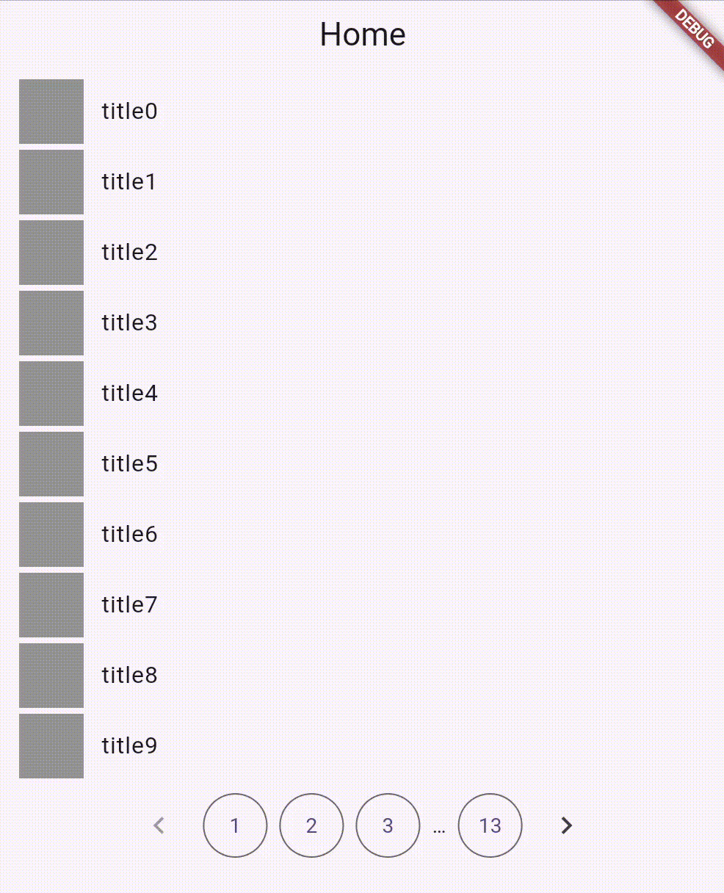

## Pazzy



**Pazzy** is a simple and flexible Flutter pagination widget library that supports both numbered and numberless pagination styles.


## Features

- 🔢 Numbered pagination with fully customizable buttons
- ⏩ Numberless pagination with "Previous" and "Next" buttons only
- 🔧 Highly customizable builders for pagination controls and items

## Getting started

To start using **pazzy**, simply add it to your `pubspec.yaml`:

```yaml
dependencies:
  pazzy: ^1.0.0
```

Then run:

```
flutter pub get
```

## Usage

Here’s a basic example using the numbered pagination widget:

```dart
PazzyWidget(
  itemCount: 100,
  currentPage: 1,
  perPage: 10,
  itemBuilder: (context, index) => ListTile(title: Text('Item $index')),
  numberBuilder: (context, number, current) {
    if (number == null) return const Center(child: Text('…'));
    return TextButton(
      onPressed: () => print('Go to page $number'),
      style: OutlinedButton.styleFrom(
        padding: EdgeInsets.zero,
        minimumSize: const Size(52, 44),
        maximumSize: const Size(52, 44),
      ),
      child: Text('$number');
    );
  },
  previousButtonBuilder: (context, previousPage) => IconButton(
    icon: const Icon(Icons.keyboard_arrow_left),
    style: IconButton.styleFrom(maximumSize: const Size(44, 44), minimumSize: const Size(44, 44)),
    onPressed: previousPage != null ? () => print('Go to $previousPage') : null,
  ),
  nextButtonBuilder: (context, nextPage) => IconButton(
    icon: const Icon(Icons.keyboard_arrow_right),
    style: IconButton.styleFrom(maximumSize: const Size(44, 44), minimumSize: const Size(44, 44)),
    onPressed: nextPage != null ? () => print('Go to $nextPage') : null,
  ),
  itemsAndPaginationSpacing: 8,
  numberButtonSpacing: 8,
);
```

For simpler pagination, use PazzyNumberlessWidget:


```dart
PazzyNumberlessWidget(
  itemCount: 30,
  currentPage: 2,
  perPage: 5,
  itemBuilder: (context, index) => Text('Item $index'),
  previousButtonBuilder: (context, previousPage) => TextButton(
    onPressed: previousPage != null ? () => print('Go to $previousPage') : null,
    child: Text('Previous'),
  ),
  nextButtonBuilder: (context, nextPage) => TextButton(
    onPressed: nextPage != null ? () => print('Go to $nextPage') : null,
    child: Text('Next'),
  ),
  paginationTextBuilder: (context, current, numberOfPages) =>
      Text('Page $current of $numberOfPages'),
)
```

## Additional information

- 💬 Feedback and contributions are welcome! Feel free to open an issue or submit a pull request.
- 🐛 Found a bug? Please report it via the GitHub Issues tab with clear reproduction steps.
- ✨ If you like this package, give it a ⭐ on pub.dev
